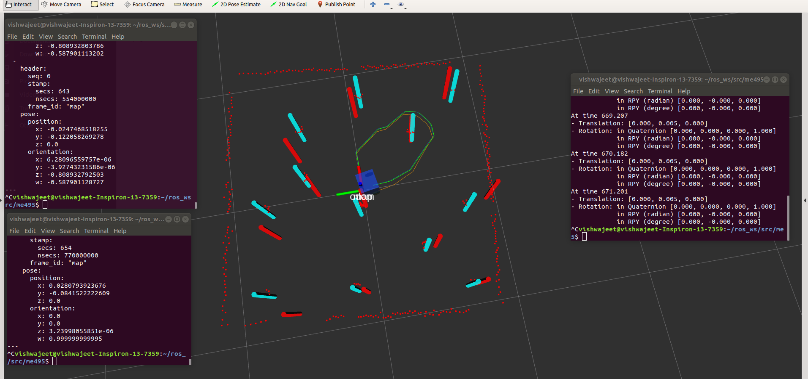

### "ME495 Sensing, Navigation, and Machine Learning"   ###

Author: Vishwajeet Karmarkar  
vishwajeetkarmarkar2021@u.northwestern.edu:  

Results:  
L.002: 
Detection radius = 2
sensor co_variance = 0.000001  
gaussian noise co_var laser scan = 0.01  

Error 1, Actual - Slam :  
x_error = -0.0528m  
y_error = -0.0379m  

Error, Slam - Odom :  
x_error = 0.00  
y_error = 0.005  

Error 2, Actual - Odom :  
x_error = -0.0528m  
y_error = -0.0373m  

