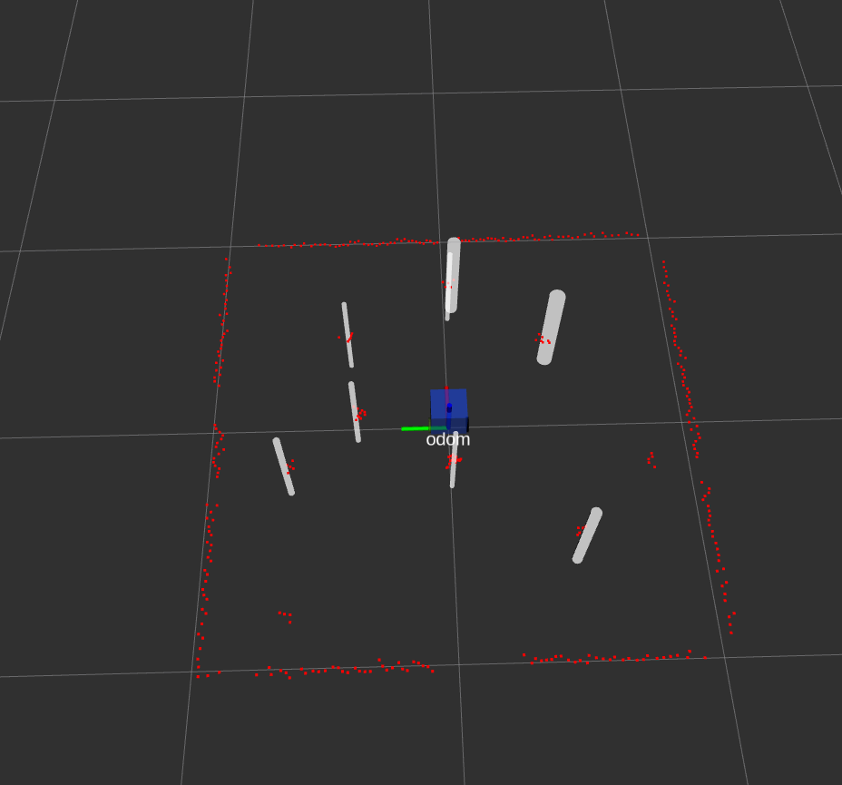

### "ME495 Sensing, Navigation, and Machine Learning"   ###

Author : Vishwajeet Karmarkar  

This package is used to implement EKF slam on a turtlebot  

To launch the contents :  

You can launch it in debug mode and normal mode  
In debug mode gazebo model state is used to populate sensor messages  
so that slam can be tested without worrying about data association  

to launch only landmark detector:: 
<pre><code>roslaunch nuslam landmarks.launch robot:=-1 
</code></pre>
It looks as follows  

robot argument is dependent on choice of platform  
this launch file also starts a keyboard teleop system which can be used to  
navigate the bot 

to launch slam 

<pre><code>roslaunch nuslam slam.launch robot:=-1 debug:=True </pre></code>

debug argument can be changed as needed

